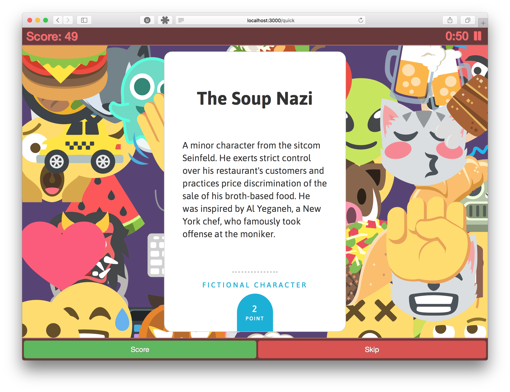

# Internet Famous, An Open-Source Rendition of a Party Game Classic

Internet Famous is a digital version of the classic Celebrities or Hat Game party game. More specifically, it's an open-source version of Alex Hague and Justin Vickers' [http://monikersgame.com](Monikers). The game itself is pretty straightforward. You spit your group into two teams, and have 60 seconds to get your team to guess as many weird, quirky card titles as possible. In the first round, you can say anything you want to. In the second round, you can only say a single word. In the third round, you can't say a thing, and play charades to get your friends to guess the card. The catch is that reach round is played with the same deck of cards, meaning that there's a pretty good chance you'll come up with some good in-jokes by the time you make it to the last round.

## How To Play

Skip the boring compiling and building stuff, just point your web browser at https://stuart-jones.com/internet-famous/

## How To Build

Oh, you actually want to do the boring compiling and building stuff. Internet Famous is built on the React JavaScript framework. It uses Redux as a state container, and Express as a simple webhost. The app doesn't have any logins or persistent state, which means it's pretty simple to build. The package.json file contains all of the NPM packages you'll need, and webpack puts everything together. If you'd like to run the game locally in development mode, copy this repository and run `npm start -s` to get a local sever running. If you'd rather build the game for production, run `npm run build`, and upload the resulting Node app to your webserver of chioce.

## Disclaimers & Licensing

Emoji art assets provided by [EmojiOne 2.3](https://www.emojione.com/emoji/v2), a Creative Commons BY 4.0 project. React-friendly SVG library coursety of wilhearts' [https://www.npmjs.com/package/react-svg-emojione](react-svg-emojione) NPM package.

Internet Famous is a Creative Commons BY-NC-SA 4.0 derivative of the card game Monikers. The name Monikers is a registered trademarked of Palm Court LLC. Internet Famous is unaffiliated with Monikers and Palm Court LLC. If you enjoy Internet Famous, why not pick up a physical copy of their game at [http://www.monikersgame.com](monikersgame.com)?

This work is available under the MIT and Creative Commons BY-NC-SA 4.0 licenses.
